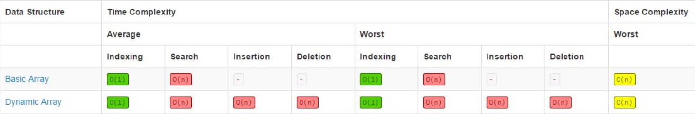

# OVERVIEW: ARRAYS

Arrays are one of the most basic data structures. They are a fundamental building block for
many other types of data structures as well.  

- They're indexable from range [0, n-1]. 

- Specifically in Java, they're fixed / not dynamic, meaning that once they're created, they'll be fixed to the given size.
  - ArrayLists offer dynamic array functionality.

- Arrays are stored as a contiguous block of memory and every element occupies the same amount of space in memory. 

- They offer fast retrieval (Constant Time - O(1)) provided you know the index of the element you need.

- Insertion / Search / Deletion all maintain a time-complexity of O(n).

### Common Uses of Arrays
- Store / access sequential data
- Temporarily store objects
- Used in IO routines as a buffer
- Lookup tables
- Helps return multiple values in where only a single return value is allowed
- Used in dynamic programming
  - To cache answers to sub-routines
    - Coin change / knapsack problems

