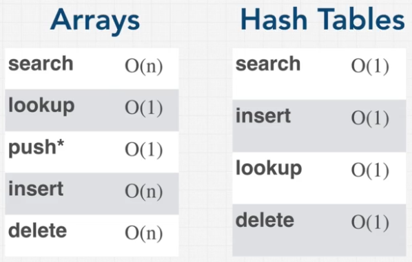

# OVERVIEW: HASH TABLES
## INTRODUCTION
Hash tables are list like data structures used to quickly store and retrieve data records via a hash function.
They rely on key-values pairs whereby a key is associated with some address in memory. This process is called ***hashing***
whereby an algorithm scrambles the key and returns an index to sort the key into the hash table.

An effective hash function, is one in which the same input always returns the same output. Additionally, it should be relatively 
simple, avoid collisions, and distribute values evenly. If a hash function is set up poorly, keys may be clumped together (i.e. clustering)
which will prevent values from being distributed in the table evenly. ***Collisions*** are instances where two inputs map to the same index.
Without addressing the collision, problems begin to arise.

_Note_: Direct access tables are NOT hash tables! They may be time efficient, but are extremely inefficient in regard to space.

## Open Addressing
Open addressing is a strategy to deal with collisions. In general, if a value is mapped to an index that is already occupied, 
the next step is to move to find the next open index and store the value there. In taking this approach, it is important to denote
indices that have once had a value stored in them as searching the table will rely on that information.

Open addressing methods include:
- ***Linear Probing*** - Continues to move to the next index to check if empty available.
- ***Quadratic Probing*** - Squares each successful step to find the next index.
- ***Double Hashing*** - If an index is taken, a second hash function produces another index.

- PROS:
  - Doesn't require additional data structures.
  - Table can be completely filled.
- CONS:
  - More complex computation involved.
  - A filled table will prevent values from being added.

## Closed Addressing
Closed address seeks to resolve collisions through ***chaining***. Rather than searching for an available index to store the value,
an array in the index expands to take in values mapped to that index. Each index in the array is built as a bucket, where the same index can hold 
multiple keys.
- PROS:
  - Simpler insertion / deletion.
  - You can always add more data to the table.
- CONS:
  - Requires additional data structures and thus more memory & processing.
  - Same indexes / slots in the table may never be used.
  - A bad hash function can cause very long chains at a given index (which decreases efficiency).

## Hash Table Implementation Methods
| Method       | Probing                    | Chaining                     |
|--------------|----------------------------|------------------------------|
| Search       | Pass key to hash function, see if value at index exists or probe until empty index is found. | Hash the key and search data structure until value is found. |
| Insert       | Hash key at the index or probe until empty index is found | Hash key at the index and add to the existing data structure. |
| Remove       | Search function followed by deletion. Must flag that an element was deleted to ensure future probes know whether to stop or continue jumping. | Hash the key, then delete the element from the data structure at that particular index. |

### RESOURCES
[Hash Table Interview Questions](https://www.geeksforgeeks.org/top-20-hashing-technique-based-interview-questions/)  
[Closed Addressing Visualization](https://www.cs.usfca.edu/~galles/visualization/ClosedHash.html)  
[Open Addressing Visualization](https://www.cs.usfca.edu/~galles/visualization/ClosedHashBucket.html)