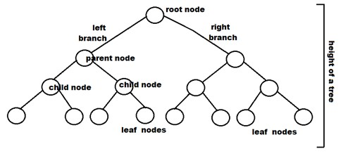
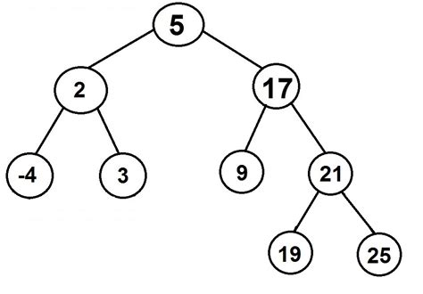
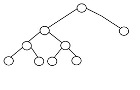
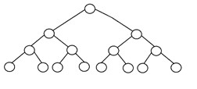
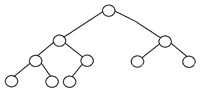
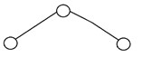
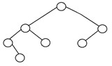
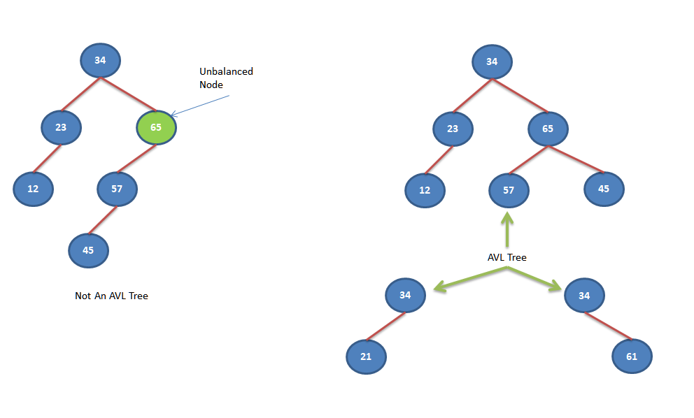

# OVERVIEW: TREES

## INTRODUCTION
Trees are hierarchical data structures with uses in data storage, improving memory use efficiency, and fast retrievals. Real world examples include:
- Basic File Storage
- Comment Trees (i.e. commenting on comments like Reddit)
- Order of Operations
- DOM Tree (Document Object Model)
- Data Compression Algorithms

Trees start at the top with the ***root*** node. From the root, the tree grows downward with branches extending downward to the next (child) nodes. 
Child nodes who have no descendents are called **leaf** nodes. The ***height*** of the tree is denoted by the longest path from a leaf node, back to
the root node.

## Binary Trees
Binary trees are unique in that each node can only have between 0 - 2 children. Each node within the tree maintains 3 pieces of information:
- Value: The data contained within the node.
- Left pointer: pointing to the lesser child node.
- Right pointer: pointing to the greater child node.  

Binary trees organize the values of nodes by positioning a lesser element to the left of the current node, and greater elements to the right of the current node.

## Types of Binary Trees
***Credit: Rohit Sharma @ UpGrad*** -- [5 Types of Binary Trees](https://www.upgrad.com/blog/5-types-of-binary-tree/)
###Full Binary Tree
It is a special kind of a binary tree that has either zero children or two children. It means that all the nodes in that binary tree should either have two child nodes of its parent node or the parent node is itself the leaf node or the external node.
In other words, a full binary tree is a unique binary tree where every node except the external node has two children. When it holds a single child, such a binary tree will not be a full binary tree. Here, the quantity of leaf nodes is equal to the number of internal nodes plus one. The equation is like L=I+1, where L is the number of leaf nodes, and I is the number of internal nodes.  

###Complete Binary Tree
A complete binary tree is another specific type of binary tree where all the tree levels are filled entirely with nodes, except the lowest level of the tree. Also, in the last or the lowest level of this binary tree, every node should possibly reside on the left side. Here is the structure of a complete binary tree:  

###Perfect Binary Tree
A binary tree is said to be ‘perfect’ if all the internal nodes have strictly two children, and every external or leaf node is at the same level or same depth within a tree. A perfect binary tree having height ‘h’ has 2h – 1 node. Here is the structure of a perfect binary tree:  

###Balanced Binary Tree
A binary tree is said to be ‘balanced’ if the tree height is O(logN), where ‘N’ is the number of nodes. In a balanced binary tree, the height of the left and the right subtrees of each node should vary by at most one. An AVL Tree and a Red-Black Tree are some common examples of data structure that can generate a balanced binary search tree. Here is an example of a balanced binary tree:  

## AVL Trees
AVL tree is a binary search tree in which the difference of heights of left and right subtrees of any node is less than or equal to one.AVL Trees are ***self-balancing***. The tree rotates (balances) on a value in the tree to ensure that the height proportions are maintained.
A difference of 0 - 1 in height between branches means the tree is balanced, where a difference greater than 1 means it is _unbalanced_.  

### RESOURCES
[Binary Tree Interview Questions & Practice Problems](https://medium.com/techie-delight/binary-tree-interview-questions-and-practice-problems-439df7e5ea1f)  
[Difference Types of Trees](https://github.com/trekhleb/javascript-algorithms/tree/master/src/data-structures/tree)  
[Binary Tree Visualization](https://www.cs.usfca.edu/~galles/visualization/BST.html)  
[AVL Tree Visualization](https://www.cs.usfca.edu/~galles/visualization/AVLtree.html)  
[Interview Question: Covert to Balanced BST](https://www.geeksforgeeks.org/convert-normal-bst-balanced-bst/)  
[Interview Question: Determine if a BST is balanced](https://www.geeksforgeeks.org/how-to-determine-if-a-binary-tree-is-balanced/)  
[Interview Question: Whiteboard an AVL Tree](https://www.youtube.com/watch?v=rbg7Qf8GkQ4)  