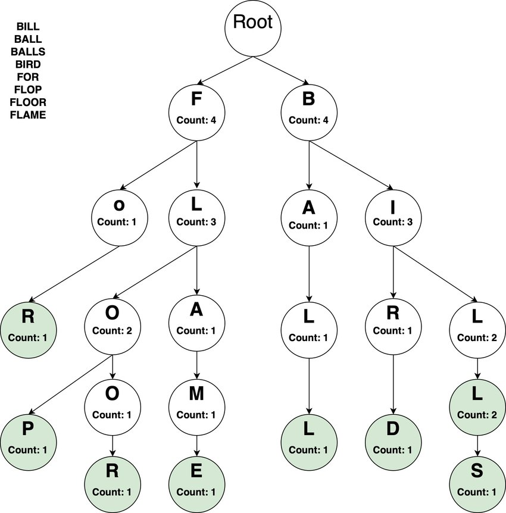

# OVERVIEW: TRIES
## INTRODUCTION
Tries are similar to trees in that it starts up at the root node and each node contains information related to the value and pointer / references the next node. Each node can be
thought of as storing a list of child nodes. Tries almost always store alphabetical data. They are not often used on their own, and can be seen in action in autocomplete, which attempts to guess the word that a user is intending to enter.
A path in a trie will contain a word or substrings of a word.  

Tries excel and outperform other data structures depending on the type of search and maintain significant memory 
efficiency.

### RESOURCES
[Trie Visualization](https://www.cs.usfca.edu/~galles/visualization/Trie.html)  
[Trie Implementation](https://github.com/trekhleb/javascript-algorithms/tree/master/src/data-structures/trie)  
  