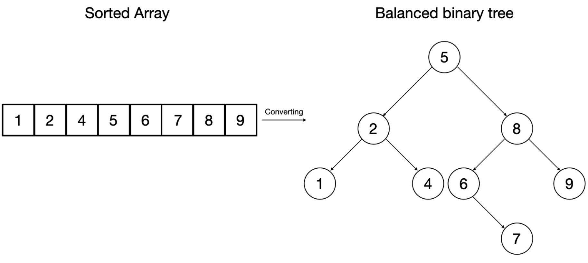

# BRUTE FORCE & BINARY SEARCHING

## Brute Force / Linear Search
A standard and elementary approach to searching (especially using loops) involves iterating over each element
until either what you're searching for is found, or you run out of elements. It's called ***brute force*** as there is no real finesse 
or strategy in determining how you search, it is simply _search the entire collection_.  

This type of search will obviously work, and might be ok to do if you're only looking for a value in a collection of maybe 5 or 10 items.
But when it becomes necessary to find the needle in the haystack: scanning bit by bit for the needle is incredibly slow and inefficient. While
a brute force search can be improved by including a _break_ statement when you find what you're looking for, there is no guarantee that what you're trying
to find will appear early in the search, or even exist in what you're searching at all! If you need to scan a million-item array, if the value you seek is the last element
or simply not present, you will still have to search a million items.

***Complexity:***
- ***Time:*** O(n)
- ***Space:*** O(1)

## Binary Search
Binary search can dramatically reduce our search time! However, it requires whatever we are searching to be in sorted 
order! In a sorted collection
binary search begins by targeting the middle element of the collection as its first search (or the item to the left of 
the middle when there are an even number of items).
From here, if the item is found, great! the search ends. If not, the next search will take place in one of the two 
partitions. Because the collection is in sorted order: The left partition contains all the values
***less than*** the first searched item, and the right partition contains values ***greater than*** the first searched item. Binary search will jump into one of these two partitions
depending on the values it seeks. It takes the same approach, starting in the middle, checking for the value, and halving the remaining values to search.  

As an example, say we are looking for the value: ***2***  

- 1st search targets the middle value (i.e. 6)
  - [1,2,3,4,5,6,7,8,9,10,11]
- 2nd search will operate on the left partition, the numbers 7,8,9,10,11 are irrelevant.
  - [1,2,3,4,5,6] <- 2nd search tagerts 3 & splits the array again.
- 3rd search will move to the left and target 1:
  - [1,2]
- Finally, the 4th search yields our desired value: 2, when is in the right partition:
  - [2]

Binary search can be modified to return a negative index (indicating the value is not present), but the absolute value of the number that is returned represents the index of where
the searched number should be / can be inserted.

***Complexity:***
- ***Time:*** O(log n)
- ***Space:*** O(1)

The beauty of sorted elements is that they can be easily visualized as a binary tree:
