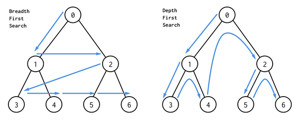
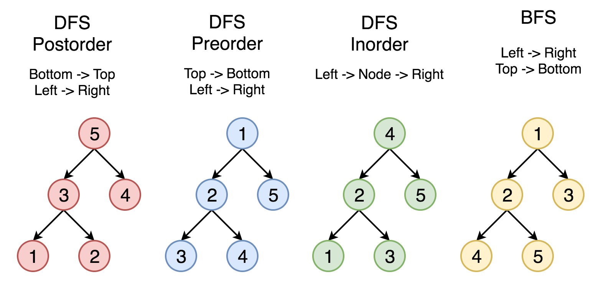

# DEPTH-FIRST & BREADTH-FIRST SEARCH
Depth-first Search (DFS) and Breadth-first Search are two ways in which we can
traverse graphs and trees.  
  

- ***Depth-First*** - Gets as far from the root as possible. It travels to a terminating node before back-tracking. It
can be slow if the tree is very deep, but it has a lower memory requirement and helps determine if a path exists.
- DFS can be implemented in 3 different ways:
  - Pre-Order
  - In-Order
  - Post-Order
  - 

  
- DFS is best used when:
  - Value is closer to the bottom / further away.
  - A tree or graph is very wide
  - You need to be memory efficient.
  - You're trying to understand dependencies in the data.
  - You need to use recursion.  

- ***Breadth-First*** - Stays as close to the root as possible. It requires more memory as it must keep track of child
nodes that it must visit but is excellent in establishing the shortest path. 
  - Best used when:
    - You know the value is closer to the top of the tree.
    - The tree is very deep.
    - Memory use isn't an issue.
    - You're trying to find the shortest path.
    - You want to use iteration.

# DIJKSTRA & BELLMAN-FORD
These two algorithms are excellent in determining the shortest path and can account for weighted graphs. But differences
between them exist:

***
***Bellman-Ford*** is capable of handling negative weights on a graph, but can take a bit of time to complete.

***Dijkstra*** is more efficient but unable to handle negative weighted graphs.

### QUESTIONS TO ASK...
Should you use BFS or DFS in these instances?  

If you know a solution is not far from the root of the tree:  
BFS

If the tree is very deep and solutions are rare,  
BFS (DFS will take long time.)

If the tree is very wide:  
DFS (BFS will need too much memory)

If solutions are frequent but located deep in the tree  
DFS

determining whether a path exists between two nodes  
DFS

Finding the shortest path:  
BFS