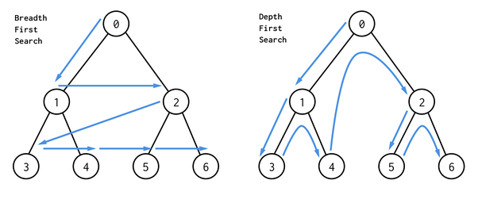

# DEPTH-FIRST & BREADTH-FIRST SEARCH
Depth-first Search (DFS) and Breadth-first Search are two ways in which we can
traverse graphs and trees.  
  

- ***Depth-First*** - Gets as far from the root as possible
  - Best used when:
    - Value is closer to the bottom / further away.
    - A tree or graph is very wide
    - You need to be memory efficient.
    - You're trying to understand dependencies in the data.
    - You need to use recursion.  

- ***Breadth-First*** - Stays as close to the root as possible.
  - Best used when:
    - You know the value is closer to the top of the tree.
    - The tree is very deep.
    - Memory use isn't an issue.
    - You're trying to find the shortest path.
    - You want to use iteration.