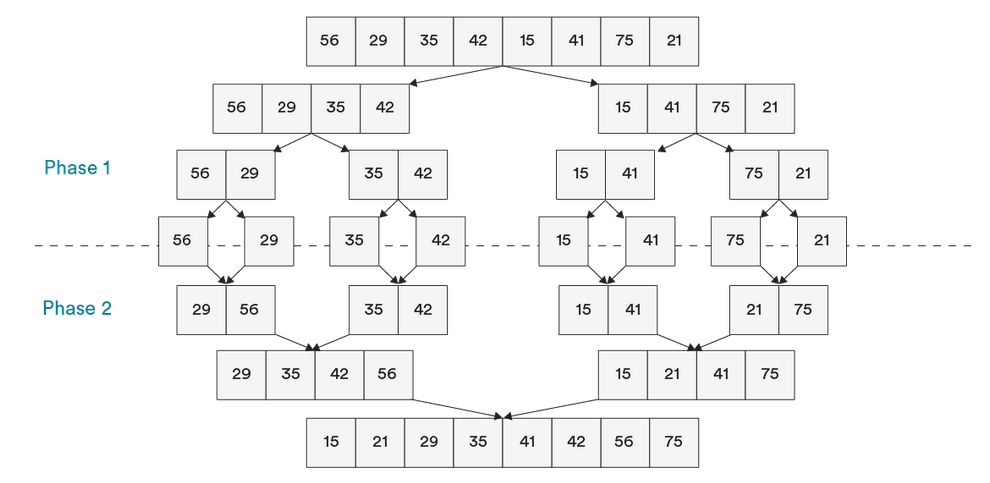
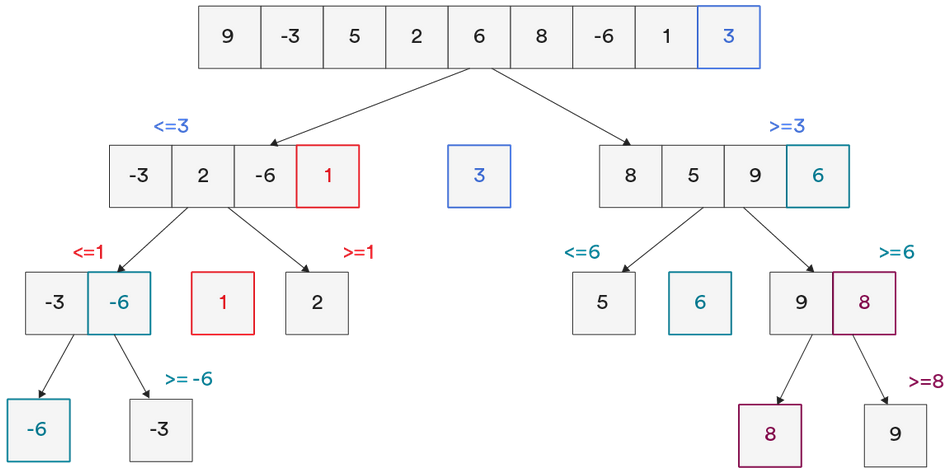

# DIVIDE & CONQUER SORTING ALGORITHMS - (Merge Sort, Quick Sort)

## MERGE SORT

Merge sort is a stable sorting algorithm that splits a collection repeatedly until it is broken into individual pieces. 
After split apart, it is merged back together in sorted order. Overall, it is based on two main premises:
* A single item list is easy to sort.
* Creating 1 large sort from 2 smaller sorts.  

Technically, merge sort involves ***two*** algorithms:
* Merge sort - O(log n)
* Merge - O(n)

Phase 1: Split the collection into the smallest individual parts (An array into single elements).  
Phase 2: Merge elements back together in sorted order.  
Base Case: An array of a single element.  
Recursive Case: Array.length > 1  

Merge sort is useful in certain database scenarios, when data may arrive during or after sorting, and is used by Safari
and Firefox in their JavaScript implementation of .sort().  

***Complexity:***
- ***Time:*** O(n log n)
- ***Space:*** O(n)

## QUICK SORT

Quick sort is an unstable sorting algorithm that begins by choosing an element within an array as a ***pivot***. This pivot 
is typically the first or last item in the array and acts as a divider on which the array is split into two partitions.
These partitions hold the values being either less than or greater than the value of the pivot.  

Both Quick & Merge sort have similar average time complexity Θ(n log n). Quick sort comes out ahead in most cases in 
that it uses less space despite its slower time but falls behind when dealing with collections with many similar values
i.e. -> [2,2,2,3,3,4,4]  

Quick sort comes built-in with many C-programming languages (Python, Java) and is typically better suited in virtual memory
and caching environments.

***Complexity:***
- ***Time:*** O(n^2)
- ***Space:*** O(log n)