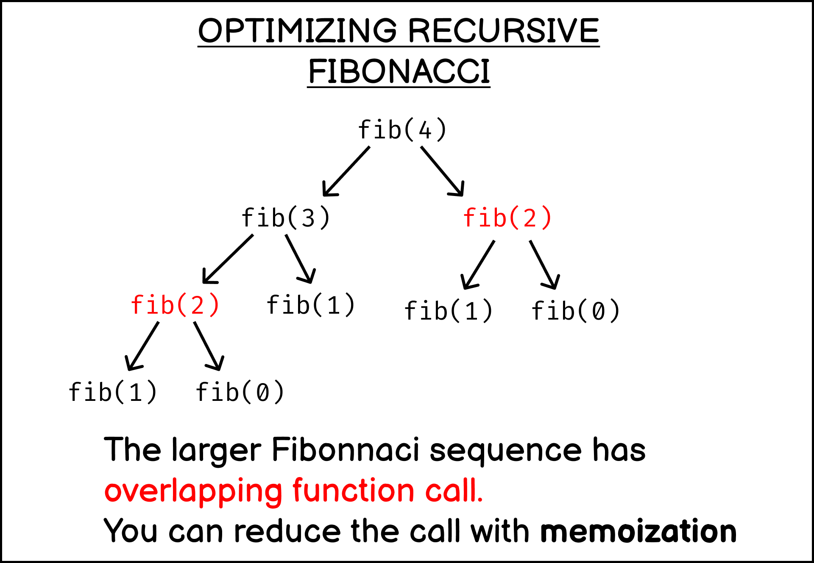
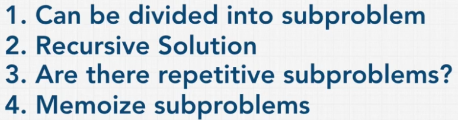

# OVERVIEW: DYNAMIC PROGRAMMING
### INTRODUCTION
Dynamic programming was developed by Richard Bellman in the 1950s and has numerous applications across several disciplines.
While it is often comes off as a fancy buzzword, at its core dynamic programming is an optimization technique for
solving complex problems. Per its definition:  

```"Dynamic programming is a method for solving complex problems by breaking them down into simpler subproblems."```

Solving dynamic programming problems can be split into 3 important steps:
1. Define sub-problems.
2. Write down the recurrence that relates sub-problems.
3. Recognize and solve the base cases.

### MEMOIZATION
If we find ourselves with the ability to cache information that we will use again in solving a problem, ***memoization***
can help us in finding a solution.

```Memoization is a specific form of caching that involves caching the return value from a function based on its parameters```

A great example at illustrating this involves the fibonacci problem. This problem can be solved iteratively or recursively,
with the recursive approach being simpler to read. But a recursive solution still ends up with a O(n^2) exponential time 
complexity! By using memoization we can cache the many repetitive calculations we perform and significantly lower the 
time complexity to O(n) while increasing the space complexity.





In the above image, Fib(2) is done twice! The initial parameter is 4, which is fairly small. If it grows larger, 
many calculations will be repeated, again and again. By caching these calculations, we can simply retrieve the value
returned from them (stored in the cache) rather than proceeding to repeat the calculations again unnecessarily. 
Dynamic programming is often thought of as the combination of divide & conquer problem-solving and memoization.

### STEPS TO SOLVING A PROBLEM WITH MEMOIZATION
