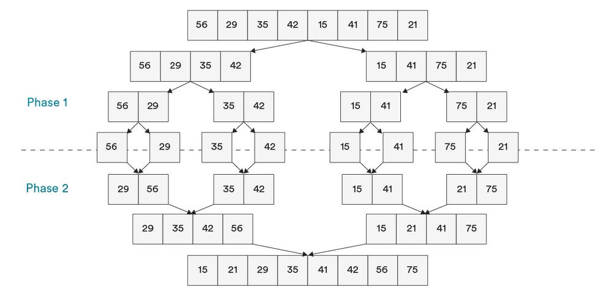

# OVERVIEW: SEARCHING & SORTING
## INTRODUCTION

## MERGE SORT

## QUICK SORT

### RESOURCES
[Subjective Interview Questions on Bubble Sort Set 1](https://hoven-in.appspot.com/Home/Data-Structures/Data-Structure-Interview-Questions/interview-questions-on-bubble-sort-01.html)  
[Programming with JS: Insertion Sort](https://hackernoon.com/programming-with-js-insertion-sort-1316df8354f5)  
[Comparison Sorting Algorithms](https://www.cs.usfca.edu/~galles/visualization/ComparisonSort.html)
[Merge Sort Algorithm Lecture](https://www.youtube.com/watch?v=TzeBrDU-JaY)  
[Quicksort Algorithm Lecture](https://www.youtube.com/watch?v=COk73cpQbFQ&list=PL2_aWCzGMAwKedT2KfDMB9YA5DgASZb3U&index=9)  
[Radix Sort Implementation](https://github.com/trekhleb/javascript-algorithms/tree/master/src/algorithms/sorting/radix-sort)  
  
  