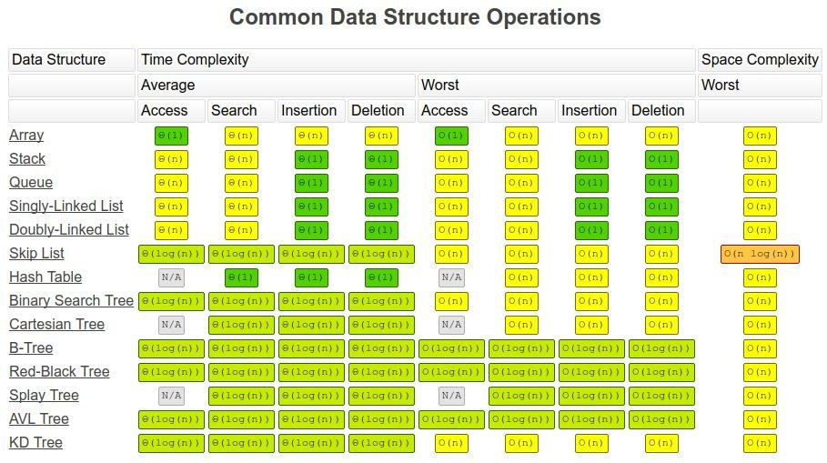

# Big O & Complexity Analysis
## INTRODUCTION
Writing good code is often centered around 2 main points:  
* READABILITY: Can other people make sense of what you have written. Is it succinct or overly verbose?
* SCALABILITY: How does it perform? Does the design allow for adaptation or will performance suffer when facing unknown conditions?

When discussing performance / efficiency of code, it helps to ask 2 main questions:  
    1. How much time is needed to solve the problem?  
    2. How much space does the problem require for its computation?

Time & Space complexity are intertwined when it comes to performance. While memory is less expensive than it used to be, 
it is still an important factor to consider. At times, there may exist a trade-off:  
- Need to compute things faster? It'll most likely require more memory.
- Need to be memory efficient? It may involve decrements in speed.

## CALCULATING BIG-O
1. Always assume the worst case!
   1. Average & best case situations are great. The element you're looking for _might_ be the first in the array... or maybe it'll
      be the last element behind a million other entries!
   2. Big-O Notation gives the upper bound (worst case) to help quantify performance
      as the input size becomes arbitrarily large. (As n grows)
2. Remove Constants
   1. The process of solving a problem can involve many operations but constants become irrelevant when input size gets enormous!
   2. Example: [6n^2 + n + 8] = O(n^2)
3. Identify Different Inputs Appropriately!
   1. Two sequential for-loops can be misrepresented as (n * n) - but if the inputs in those loops are different, then the actual
      result is (n * m).
4. Only the Dominant Term Matters
   1. The Big-O may be [n^2 + 100000n] and will simply boil down to [n^2].

## TIME / SPACE COMPLEXITY OF COMMON DATA STRUCTURES

## TIME / SPACE COMPLEXITY OF COMMON ALGORITHMS

### RESOURCES
[Sorting Visualizer](https://www.sortvisualizer.com/)
