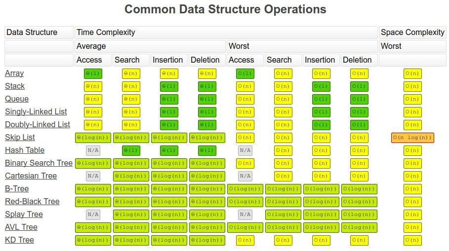
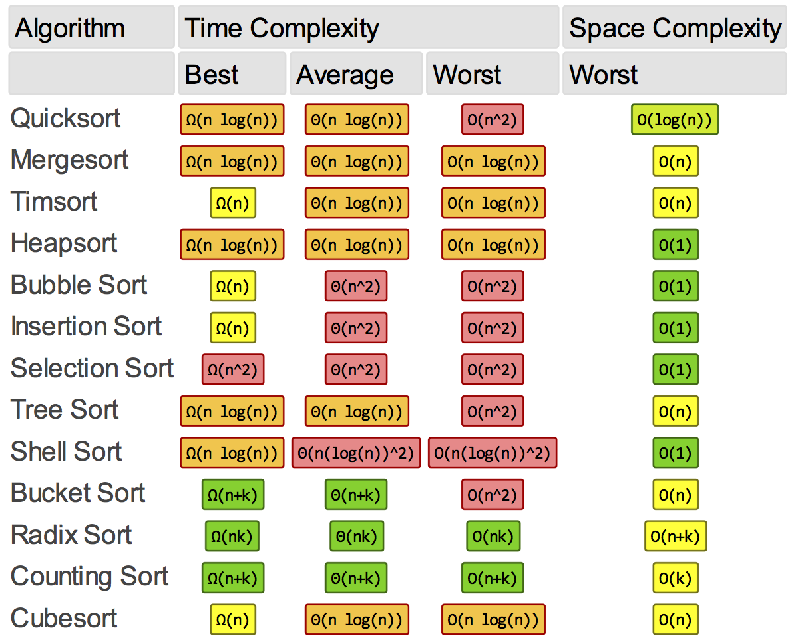

# Big O & Complexity Analysis
# INTRODUCTION
We often ask 2 main questions:
    1) How much time does this algorithm need to finish?
    2) How much space does this algorithm need for its computation?

Big-O Notation -> gives the upper bound (worst case) to help quantify performance
                  as the input size becomes arbitrarily large. (As n grows)

In general, constants are ignored. [6n^2 + n + 8] = O(n^2)

### RESOURCES
[Sorting Visualizer](https://www.sortvisualizer.com/)
